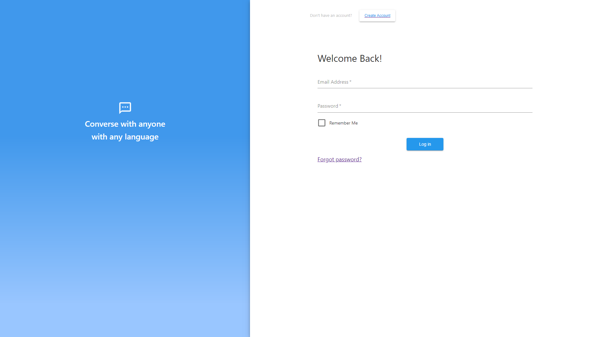

# Team Mint Oreo: Babl <!-- omit in toc -->

Table of Contents:

- [Preview](#preview)
- [About](#about)
- [Authors](#authors)
- [Setup Guide](#setup-guide)
	- [Getting Started](#getting-started)

# Preview

# About

Babl: The messaging app with built in translation. Have you ever had trouble communicating with someone in a foreign language? Fear not, Babl is here.

Babl automatically translates text messages sent from your friends to your native language. No matter what language they speak, you will have a translation to your primary language.

**Tech Stack**

MERN (Mongo, Express, React, Node)

| Other Technology Highlights |
| :-------------------------: |
|         material-ui         |
|          socket.io          |
| googleapis/nodejs-translate |
|         aws-sdk-js          |

# Authors

Built by [Jimmy](https://github.com/Rocket-Fish), [Brian](https://github.com/brianqian), and [Sang min](https://github.com/slee288)

# Setup Guide

- [ ] Add Setup Guide for cloners

## Getting Started
